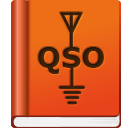

# QSOurce Logger

## Intro

 QSOurce Logger is an attempt to provide a flexible amateur 
radio logging program for both general logging
and beginner to intermediate contesting. It is cross-platform and leverages existing CAT interface layers
for CAT control.

The project was originally forked from Not1mm - thanks to the original authors for the starting point and inspiration.

  &nbsp;

The QSO entry interface is partially informed by n1mm+ with additional windows and tools available to enhance the experience
of making amateur radio contacts.

## Feature list

Check the [project wiki](https://github.com/kyleboyle/qsource-logger/wiki) for more information

## List of should be working contests

- General Logging - similar options to [n1mm dx](https://n1mmwp.hamdocs.com/manual-supported/contests-setup/setup-dx-contests/) Generic Contests
  - General DX Logging
  - DXpedition
  - DX Serial
  - DX Satellite
  - VHF DX
  - VHF Serial
- 10 10 Fall CW
- 10 10 Spring CW
- 10 10 Summer Phone
- 10 10 Winter Phone
- ARRL 10M
- ARRL DX CW
- ARRL DX SSB
- ARRL Field Day
- ARRL Sweepstakes CW
- ARRL Sweepstakes SSB
- ARRL VHF January
- ARRL VHF June
- ARRL VHF September
- CQ 160 CW
- CQ 160 SSB
- CQ WPX CW
- CQ WPX SSB
- CQ World Wide CW
- CQ World Wide SSB
- CWOps CWT
- IARU HF
- Japan International DX CW
- Japan International DX SSB
- NAQP CW
- NAQP SSB
- Phone Weekly Test
- RAC Canada Day
- Stew Perry Topband
- Winter Field Day

